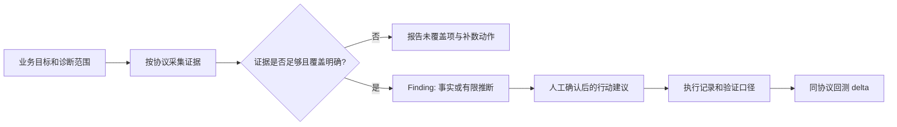

# Veris SEO / GEO 诊断可信报告：盲区扫描与优化实施方案

> 状态：实施决策稿
>
> 适用范围：Veris 当前 `SEO + GEO 证据化诊断台`
>
> 与 [`plan-ux.md`](./plan-ux.md) 的关系：本文件不替代已有产品方案；它把「报告何时可被信任、缺什么资源、按何顺序补齐」落实为可实施的约束和验收标准。

---

## 1. 先定结论：我们交付的不是“SEO 总分”，而是可复核的决策报告

Veris 的定位应固定为：**把站点、搜索表现、SERP 和 AI 搜索样本转成带证据、带不确定性、可回测的行动建议**。

它不应承诺以下事情：

- 不承诺某个改动一定带来排名、询盘或 AI Overview 引用。
- 不把 GSC 低 CTR 直接归因为 AI Overview 截流。
- 不把 AI API 的一次或少量回答，包装成“所有真实用户都看到了”。
- 不把 `site:` 搜索结果、Schema 类型数量、健康分当作 Google 的官方索引/质量结论。
- 不把“本轮没有发现 finding”解释为“站点没有问题”。它也可能表示证据没有采到或覆盖不完整。

一份对用户真正有用的报告，至少要让用户回答五个问题：

1. **现在确实发生了什么？** 结论要回链到页面、查询、SERP、AI 回答或原始采集证据。
2. **这件事有多确定？** 必须标注硬实测、样本实测、推断或假设。
3. **为什么值得优先处理？** 要连接曝光、点击、线索或商业目标，不能只报技术异常。
4. **具体做什么？** 动作要定位到页面/关键词/内容集群/技术项，并说明依赖和风险。
5. **怎样验证有效？** 明确基线、指标、观察窗口、前后是否可比。

目标闭环如下：

---

## 2. 当前能力基线：已有什么，不能因此推导什么

当前实现已经有很好的“证据先于结论”基础：`evidence_artifacts` 保存原始/结构化证据；`findings` 强制带 `evidence_refs`；采集完成后由确定性规则生成 findings 和 recommendations；建议经人工接受或编辑后才进入路线图和输出。

| 诊断面 | 当前已具备的证据 | 当前可安全得出的结论 | 仍不能直接得出的结论 |
|---|---|---|---|
| 技术可发现性 | 页面抓取、robots、sitemap、全站轻检、模板代表页深检、渲染比对、PageSpeed | 已检查页面是否有 noindex、错误码、站外 canonical、孤岛、JS 依赖、部分 CWV/结构问题 | 整站已被 Google 收录；所有搜索或 AI 爬虫都无法读取 JS 内容 |
| 内容与结构化数据 | HTML、标题/H1、Schema、站点结构、重复和内容结构规则 | 指定范围内的内容/Schema/内链风险 | 内容“质量高”、类型数越多越好、一定能获得富结果 |
| 搜索表现 | GSC query、page × query 数据；可选第三方关键词数据 | 有展示/点击/CTR/平均排名的关键词机会、蚕食和页面关联 | CTR 下跌的唯一原因；未接 GSC 时的真实自然搜索表现 |
| 搜索前台与竞品 | Google CSE `site:` 信号；DataForSEO 的 Top-N、关键词、外链估算 | 特定时间和参数下的外部可见性/竞品样本 | Google 官方索引数量、全市场份额、绝对外链真相 |
| GEO / AI 搜索 | 固定 prompt 的多 provider 探针、答案原文与引用、AI UA 探测、第三方语料检查 | 在这套协议和样本下，品牌被提及/引用的频率与样本差异 | 所有用户在 ChatGPT、Google AIO 或其他 AI 产品中的真实可见度 |
| 商业结果 | 当前没有一等数据源 | 无 | 某 SEO/GEO 问题是否真正造成线索、商机或收入损失 |

### 2.1 已存在、但需要收紧文案的三类指标

1. **索引可见性卡**

   当前 CSE `site:domain` 结果是外部前台信号，应该固定标为 `L2 / 估算信号`，不能命名为“索引量”或“Google 官方收录”。

2. **可抓取正文占比**

   初始 HTML 与渲染正文的比值，可证明“非渲染抓取链路的可读性风险”；不能写成“所有 AI 都读不到”。

3. **Schema 覆盖**

   当前卡片可从类型数派生。类型数不是质量或覆盖率，应改名为“检测到的结构化数据类型数/足迹”，并把语法、必填字段、前端一致性和模板覆盖另行展示。

### 2.2 最关键的产品盲区

现有系统最主要的缺口不是“规则不够多”，而是以下四条证据链尚未闭合：

- **业务链缺失**：站点异常 → 搜索表现 → 线索/商机/收入，最后一段没有一手数据。
- **索引链缺失**：公开抓取/前台搜索 → Google 实际索引和关键 URL 状态，缺少官方检查证据。
- **SERP 因果链缺失**：GSC 低 CTR → 同位置、同地区、同设备、同日期的 SERP 特性/AIO 现场证据，当前不能稳定建立。
- **GEO 代表性链缺失**：API 探针样本 → 面向用户的 AI 产品真实体验，必须保留“协议样本”边界。

---

## 3. 诊断报告合同（Report Contract）

每次 run 在展示 findings 前，先生成并展示“诊断合同”。它把本次可回答的问题和不可回答的问题写清楚，避免用户把空白误解为良好状态。

### 3.1 报告必须包含的固定字段

| 字段 | 要求 |
|---|---|
| 诊断范围 | 域名、入口 URL、目标市场、语言、设备、采集时间、爬取页数/深度和关键页面范围 |
| 数据源状态 | 每个数据源的 `已配置 / 已授权 / 已尝试 / 已采到 / 失败 / 未覆盖` 和失败原因 |
| 覆盖度 | 发现 URL 数、实际轻检数、截断数、深检模板/关键页数、GSC 时间窗、AI 有效样本数 |
| 结论等级 | `L4 硬实测`、`L3 样本实测`、`L2 推断`、`L1 假设`；所有 finding 与建议都可追溯 |
| 业务目标 | 本次目标是可发现性、自然流量、有效询盘、品牌提及、引用率，还是其中组合 |
| 排除项 | 未接数据源、无权访问的 URL、登录态页面、地域限制、爬取上限、未确认竞品等 |
| 回测协议 | 基线 run、指标口径、时间窗、prompt 版本、模型/地区/语言、可比性判断 |

### 3.2 报告分级：先匹配资源，再承诺输出

| 报告等级 | 最低前置条件 | 可以输出 | 必须声明的限制 |
|---|---|---|---|
| R0：采集状态 | URL 可访问 | 数据源缺口、采集失败、下一步补数动作 | 不输出健康分和业务建议 |
| R1：技术可发现性 | URL + 爬取许可 | 技术、结构、渲染、sitemap、robots、页面结构风险 | 只代表实际检查范围，不判断流量影响 |
| R2：SEO 表现 | R1 + GSC readonly | 查询/页面表现、CTR、排名机会、蚕食 | 无 SERP 现场时不归因 AIO；无转化数据时不归因询盘 |
| R3：SEO 市场机会 | R2 + 已确认竞品 + 关键词/SERP 数据 | 需求、竞品样本、关键词缺口、内容机会 | 第三方指标为估算，不能替代 GSC 真值 |
| R4：GEO 样本可见度 | R1 + 固定 prompt 协议 + AI provider | 提及率、引用率、竞品 SoV、回答/引用证据 | 仅代表记录的模型、时间、地区、语言和样本 |
| R5：业务优先级 | R2 + GA4/转化 + CRM 或线索汇总 | 按有效线索/商机影响排序的路线图与回测 | 仍需排除季节性、投放、价格等混杂因素 |

**规则：** 当报告不满足对应等级的前置条件时，UI 显示“未覆盖”，而不是 `0`、`—` 或低分。

---

## 4. 需要的资源：按价值和依赖排序

### 4.1 必需资源（先完成这组，才进入可售卖的 SEO 报告）

| 资源 | 提供方/权限 | 用途 | 最低标准 |
|---|---|---|---|
| 站点和诊断范围 | 客户/运营 | 确定入口、重点页面、市场、语言、产品线 | 域名、目标国家/语言、3–20 个关键 URL |
| GSC readonly | 站点 owner 授权 | 真实点击、展示、CTR、排名和 query-page 关系 | 选定正确 property，可读取约定时间窗 |
| 业务诊断档案 | 客户的市场/销售负责人 | 说明“什么叫有价值的访问和线索” | ICP、主营产品、主要转化、优先市场、排除业务 |
| 人工确认的竞品 | 客户 + 运营 | 限制竞品对比的业务边界 | 3–10 个直接竞品，区分业务竞品与内容竞品 |
| 一位结论确认人 | 客户侧 owner | 审核品牌事实、竞品、建议和执行优先级 | 能在一个反馈周期内确认/否决 |

### 4.2 增强资源（决定能否做 GEO、SERP 归因和商业优先级）

| 资源 | 解决的盲区 | 交付前要求 |
|---|---|---|
| GA4 或等价分析数据 | 从搜索表现走到转化事件 | 只采集聚合指标；明确表单、电话、预约、下单等事件定义 |
| CRM / 线索汇总 | 从转化走到有效询盘/商机 | 不存客户个人信息；按 URL/渠道/市场/日期做聚合即可 |
| SERP 快照服务 | 对低 CTR、featured snippet、AIO 等进行有限归因 | 能保留 query、地点、语言、设备、时间、SERP 特性、原始响应/截图 |
| AI 探针 provider | 对 GEO 做可复核样本测量 | 记录 provider、模型、联网状态、位置提示、prompt、原始回答、引用、失败状态和成本 |
| 关键词/竞品/外链服务 | 扩大市场与竞品样本 | 全部标为外部估算；必须允许人工确认竞品 |
| 对象存储/归档策略 | 保存截图、原始响应和审计证据 | 设访问控制、保留期、脱敏和成本上限；不要无限制把大文件塞进主数据库 |

### 4.3 当前仓库已预留的服务接入

现有 `.env.example` 已预留或支持以下能力：GSC OAuth、Cloudflare Browser Rendering、OpenAI/Perplexity/Gemini/DeepSeek 探针、Google CSE、DataForSEO、Inngest、Turso/libSQL。实施前不应只检查 key 是否存在，还应分别检查：环境是否配置、当前项目是否授权、此次 run 是否成功采到证据。

---

## 5. 优化实施方案

实施顺序遵循一个原则：**先让报告知道自己不知道什么，再扩充数据源；先把业务目标接入，再扩大规则数量。**

### Phase 0：报告可信度底座（P0，优先实施）

#### 目标

让任何一份报告先说明覆盖边界和结论边界，杜绝“空数据 = 无问题”。

#### 实施项

1. 新增 run 级 `data_source_status` 记录（独立表或 run 元数据均可）。
   - 字段：`source_key`、`configured`、`authorized`、`attempted`、`status`、`failure_reason`、`captured_evidence_count`、`protocol_snapshot`。
   - `status` 至少区分：`not_configured`、`not_authorized`、`not_attempted`、`collected`、`partial`、`failed`。
2. 在采集编排中把“跳过、失败、成功”全部落为状态，而不是只依靠有没有 evidence 行反推。
3. 在报告头新增“诊断范围与覆盖度”区块。
   - 复用 `site_audit` 里的 `totalDiscovered / checked / truncated / protocol`。
   - 显示 GSC 时间窗、有效 AI 样本数、已确认竞品数和缺失数据源。
4. 将现有统计卡和报告摘要统一接入 `claim level + data-source status + 限制说明`。
5. 健康分只对“已采到证据的支柱”计算，并在摘要中标为推断；缺数据支柱不能用默认分填补。

#### 主要改动面

- `db/schema.ts`：增加 run 级数据源状态模型和迁移。
- `lib/inngest/collect-evidence.ts`：每个 provider 的 guard、跳过、失败和成功均写状态。
- `lib/diagnostics.ts`、`components/StatStrip.tsx`、`components/ReportView.tsx`：统一展示 `measured / pending / partial` 的真实原因。
- `lib/diagnosis/report.ts`：报告模型增加范围、覆盖度、缺口和不可下结论的提示。
- `messages/zh.json`、`messages/en.json`：补齐面向用户的中英文限制文案。

#### 验收标准

- 断开 GSC、SERP、AI 任一数据源后，报告能明确说明该维度未覆盖，不出现伪零值。
- 爬取达到页数/深度上限时，报告明确显示 `truncated` 和实际检查比例。
- 每张统计卡都能打开到一个证据或明确的 pending/failed 原因。
- 报告摘要不再把“无 finding”翻译为“站点健康”。

### Phase 1：业务诊断档案与转化数据（P0）

#### 目标

把“发现技术问题”升级为“按业务目标排序的行动建议”。

#### 实施项

1. 新增项目级 `diagnostic_profile`。
   - `primary_goal`：可发现性、流量、有效询盘、商机、收入、品牌可见度。
   - `buyer / offer / industry / market / language / conversion_definition`。
   - `priority_pages`、`priority_topics`、`confirmed_competitors`、`excluded_segments`。
2. 接入 GA4 聚合指标，按页面/落地页、渠道、市场和时间窗采集；不采集用户级 PII。
3. 增加 CRM 或 CSV 聚合导入的轻量 adapter。
   - 最小字段：日期、市场、落地页/内容组、渠道、线索数、有效线索数、商机数。
   - 不把客户姓名、邮箱、电话等个人数据写入 Veris。
4. 在 recommendation 中增加 `business_goal`、`owner`、`expected_metric`、`baseline`、`validation_window`、`dependencies`。
5. 业务影响作为独立排序维度，不混入技术健康分，避免数据不足时被误算。

#### 验收标准

- 没有业务档案的项目仍可生成 R1–R4 报告，但不能显示“预计询盘提升”。
- 有 GA4/CRM 聚合数据时，建议可以按有效线索或商机代理指标排序。
- 所有转化结论都能回溯到聚合证据和指标定义，而非模型猜测。

### Phase 2：补齐 Google SEO 的官方证据链（P0）

#### 目标

把“公开可见性信号”和“GSC 表现数据”与“关键 URL 的 Google 状态”明确分层。

#### 实施项

1. 保留现有 Search Analytics 的 query 与 page-query 采集，增加可配置的市场、设备、日期粒度和比较窗口。
2. 接入 GSC 的关键 URL 索引检查/站点地图相关官方能力，优先覆盖：
   - 首页、主要产品/服务页、核心内容 Hub、转化页、被规则标记的异常页；
   - sitemap 提交/读取状态、抓取/索引相关的可用官方结果。
3. 新增 `gsc_inspection` 类证据及对应规则；同时保存请求范围、返回时间和原始响应摘要。
4. 区分三种报告语言：
   - `GSC 实测`：搜索表现或官方 URL 状态；
   - `公开搜索信号`：CSE/第三方前台样本；
   - `站内抓取实测`：Veris crawler 的观察。
5. 仅在 URL 状态与站内证据可比时，生成“技术问题可能影响可发现性”的推断；否则只给并列证据。

#### 验收标准

- 报告不再将 CSE `site:` 数字命名为“收录量”。
- 关键 URL 的报告能区分“我们的抓取可见”和“Google 官方状态未知/已知”。
- GSC 数据失败或权限不足时，不阻断技术报告，但会降级 SEO 表现结论。

### Phase 3：建立 SERP/AIO 归因协议（P0）

#### 目标

让“疑似受 SERP 特性影响”有资格升级为有限证据推断，而不是营销文案。

#### 实施项

1. 定义 `serp_snapshot` 协议与不可变证据模型。
   - 必带：query、国家/城市、语言、设备、采集时间、provider、原始响应版本、SERP features、截图/可访问原始证据。
   - 可选：AIO、featured snippet、PAA、购物/本地包、广告位等特性；字段应允许 provider 不能稳定返回时为未知。
2. 将 SERP 快照与 GSC 查询以 query + 市场 + 日期窗口关联，而不是只按关键词文本硬连。
3. 定义 CTR 归因阈值：
   - 仅 GSC 低 CTR：`L1 hypothesis`；
   - GSC 低 CTR + 同协议 SERP 特性：最多 `L2 inferred`；
   - 多日、多地点/设备的稳定样本：可标 `L3 measured_sample`；
   - 不允许写“AI Overview 导致 CTR 下跌”。
4. 第三方 SERP 服务可以复用当前 DataForSEO adapter 的思路，但新契约必须支持上述协议和原始证据保留；当前 Top-N 结果本身不等于 AIO 现场快照。

#### 验收标准

- 任一“SERP/AIO 影响”finding 都能打开到对应 GSC 行和一组同协议快照。
- 缺快照时，相关规则自动停留在假设层，不产生确定性标题。
- 用户能看到地点、设备、时间和样本数，知道结论适用范围。

### Phase 4：把 GEO 从“探针展示”升级为“可复现实验”（P1）

#### 目标

让 AI 可见度成为协议化样本测量，而不是模型聊天演示。

#### 实施项

1. 将已有 prompt 记录扩展为可版本化的 `prompt_set`。
   - 增加意图、漏斗阶段、业务主题、优先级、预期实体/品牌、市场、语言、版本和批准状态。
2. 冻结 run 的 GEO 协议：provider、model id/version、联网状态、参数、位置提示、执行时间、重试规则、解析器版本。
3. 所有 GEO 指标同时显示分子、分母、无效样本数和置信说明。
   - 例如：`目标品牌提及 6 / 20 个有效样本`，而不是只展示 `6`。
4. 将“品牌提及”“目标域引用”“竞品 SoV”“情感”分开计算，避免一个总分掩盖样本差异。
5. 通过人工闸门确认品牌别名、同名歧义、竞品名单与错误解析；解析失败不计入有效样本。
6. DeepSeek 等未联网或不带引用的 provider 只能用于回答样本，不得与“联网引用率”并列比较。

#### 验收标准

- 每个 GEO 指标都能回放到 prompt、模型、时间和原始回答/引用。
- 报告固定写明“本结论代表本协议样本，不代表所有用户端 AI 体验”。
- 两次 GEO 回测若协议不一致，系统显式标为不可比，不计算 delta。

### Phase 5：行动、验证和回测闭环（P1）

#### 目标

避免报告停在“建议列表”，形成能评估有效性的运营闭环。

#### 实施项

1. 强化 recommendation 的执行合同：
   - `what`、影响页面/关键词、`why`、证据、owner、工作量、风险、依赖、优先级；
   - 指标来源、基线、方向、验证窗口、成功/失败判定。
2. 只有用户接受或编辑的建议可进入路线图、执行提示词和回测排期，继续沿用当前人工闸门原则。
3. 回测前比对协议：GSC 时间窗、市场、页面范围、prompt_set、provider/model、爬取深度和数据源覆盖度。
4. 将结果分为：`improved / unchanged / regressed / incomparable / insufficient_data`，不把“finding 消失”自动等同于商业有效。
5. 报告中同时展示：实施状态、证据变化、指标变化、仍存在的混杂因素。

#### 验收标准

- 每条已接受建议都能关联到一条验证定义。
- 报告可说明为何某次回测不可比或证据不足。
- 结论页不再把健康分变化直接表述为收入或询盘效果。

---

## 6. 研发拆分与代码落点

| 工作包 | 主要落点 | 交付物 | 关键测试 |
|---|---|---|---|
| A. 覆盖度与数据源状态 | `db/schema.ts`、`lib/inngest/collect-evidence.ts`、`lib/settings/data-sources.ts` | run 级状态、失败原因、覆盖度报告模型 | provider 未配置/失败/部分成功三态；报告不生成伪零值 |
| B. 报告合同 UI | `lib/diagnosis/report.ts`、`components/ReportView.tsx`、`components/StatStrip.tsx`、i18n | 范围、等级、限制、未覆盖项、证据跳转 | 无 GSC / 无 AI / 爬取截断的快照测试 |
| C. 业务诊断档案 | `projects` 相关 schema/repository、项目设置与新建项目表单 | ICP、转化定义、重点页/主题、确认竞品 | 必填校验、PII 不落库、无档案时正确降级 |
| D. 转化聚合 adapter | 新 `lib/analytics/**`、`lib/crm/**`、evidence/repository | GA4 聚合、CSV/CRM 聚合、业务指标证据 | 聚合口径、权限失败、时间窗一致性、脱敏测试 |
| E. GSC 索引与维度 | `lib/gsc/**`、`collect-evidence.ts`、规则 context | 关键 URL 官方状态和分层报告 | property 权限、URL 范围、无权限降级、证据回链 |
| F. SERP 协议 | `lib/search/**` 或扩展 `lib/dataforseo/**`、schema、规则 | 可复核 SERP snapshot 与归因 guard | 同协议匹配、缺快照不升级 claim、截图/原文可读 |
| G. GEO 协议 | `lib/probes/**`、`prompts`/probe 相关 schema、`ai_probe_results` | prompt_set 版本、样本统计、可比性检查 | 分母/无效样本、模型不同不可比、引用解析回放 |
| H. 回测与执行 | `recommendations`、`retest_snapshots`、`generate-findings.ts` | 验证合同、可比性、结果分类 | 仅接受建议进入回测；incomparable 不写 outcome |

实施中必须保持现有铁律：finding 引用证据、推荐不直接发布、外部估算不冒充硬实测、每次 run 的原始协议可追溯。

---

## 7. 建议的落地顺序与上线闸门

### 第一个迭代：先让用户不被误导

完成 Phase 0，并同步修正文案：索引可见性、Schema 足迹、可抓取正文风险、AI 样本可见度。这个迭代无需增加付费数据源，但必须让所有空态、失败态和截断态可信。

**上线闸门：** 任一数据源缺失时，用户可在 10 秒内看懂“缺什么、因此不能判断什么、如何补齐”。

### 第二个迭代：建立可售卖的 SEO 基线

完成 Phase 1 的业务档案最小版，以及 Phase 2 的 GSC 分层和关键 URL 官方状态。优先服务已经接入 GSC、有明确获客目标的独立站/SaaS/跨境团队。

**上线闸门：** 任何“高优先级 SEO 建议”都能回答目标页面/查询、证据、业务目标、验证指标和负责人。

### 第三个迭代：把 SERP 与 GEO 做成协议化样本

完成 Phase 3 与 Phase 4。此时才把 AIO/SERP 影响和 AI 可见度作为报告卖点，而不是前置承诺。

**上线闸门：** GEO 或 SERP 结论有协议、样本、范围和原始证据；协议变更时不做伪回测。

### 第四个迭代：验证商业价值

完成 Phase 5，选择少量真实客户跑“诊断 → 接受建议 → 执行 → 同协议回测”。指标看被接受建议比例、完成率、可比回测率、用户认为有用的 finding 比例，以及有效线索代理指标的变化。

**上线闸门：** 至少能清晰区分“技术修复完成”“搜索指标改善”“业务结果改善”“证据不足/不可比”。

---

## 8. 明确不做的事情（当前边界）

- 不做自动发布内容、自动改网站、自动投放或自动外链。
- 不做“保证排名”“保证 AIO 引用”“保证询盘增长”的承诺。
- 不将第三方关键词、外链、SERP 数据升级为 Google 官方真相。
- 不保存客户线索的个人身份数据来换取商业归因。
- 不在无 GSC、无 SERP 快照或无业务数据时制造完整的增长故事。
- 不为追求健康分覆盖更多页面而掩盖爬取范围、登录墙、地域限制和采样偏差。

---

## 9. 最终验收：何时可以说“这是一份对用户有用的报告”

一份 Veris 报告只有同时满足以下条件，才可以被标为“可执行诊断报告”：

- [ ] 已显示诊断范围、数据源状态、覆盖度和未覆盖项。
- [ ] 每个 finding 有可打开的证据、claim type 和明确的适用边界。
- [ ] 每个高优先级建议都绑定业务目标、执行对象、风险、负责人和验证口径。
- [ ] SEO 表现结论优先依赖 GSC；第三方数据仅以外部估算显示。
- [ ] SERP/AIO 相关结论未越过其快照证据等级。
- [ ] GEO 结论明确其 prompt/model/时间/市场/样本协议，不泛化为全部 AI 用户体验。
- [ ] 无数据时显示“不足以判断”，而不是零分、空白或乐观结论。
- [ ] 回测比较先验证协议可比，再输出变化与效果解释。

达到这一标准后，Veris 的价值不在“做出了多少图表或规则”，而在于用户可以据此决定：**先修哪里、为什么修、需要谁做、何时判断是否有效。**
